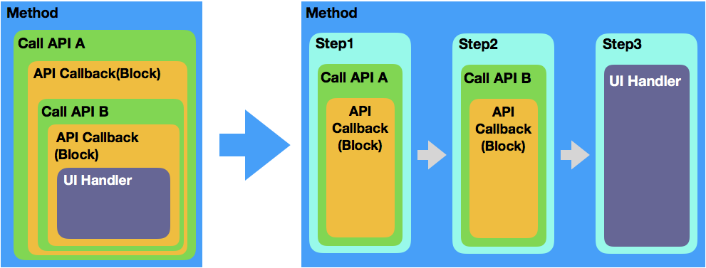

# StepFlow
A set of simplified workflow tools in Swift

# Overview:
We always need a nested block to handle the multiple async processes, e.g, server-api. 
‘Step' could flat it, just be ‘step-by-step’ to combine all async processes like a single chain.

# Before/After
 

